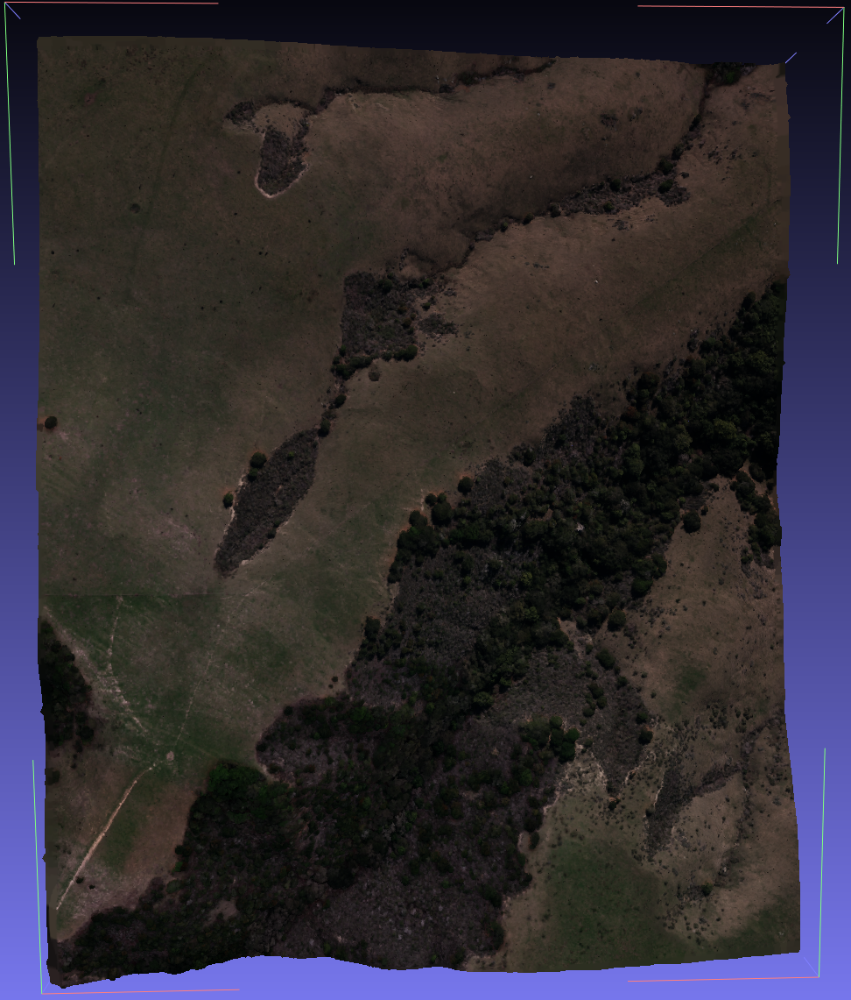
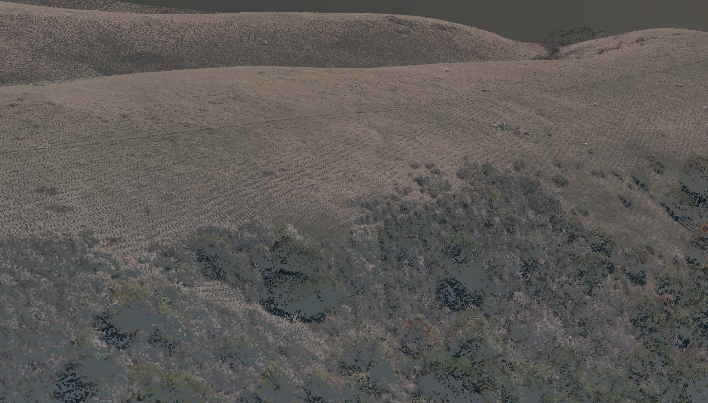
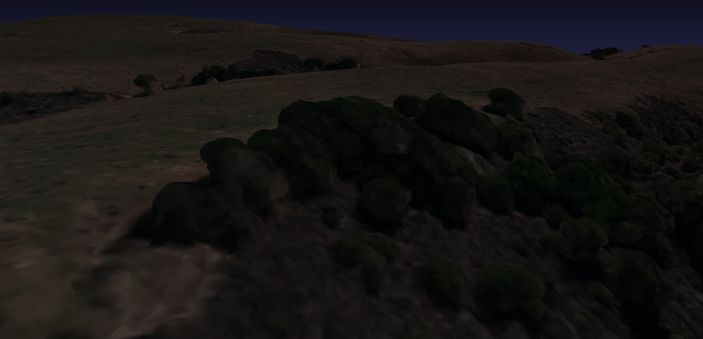
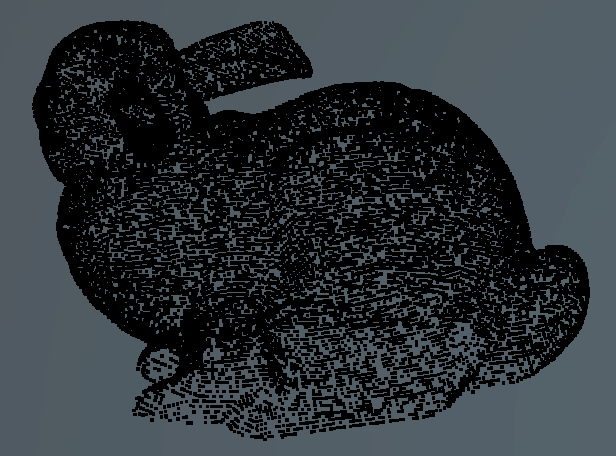
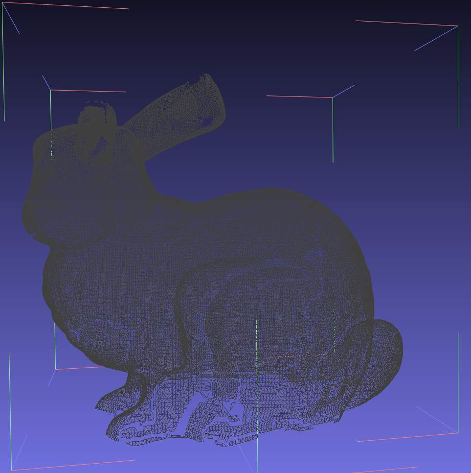

# point-cloud-tools

Small utilities to work with point clouds. Supports LAS/LAZ and E57 formats.



## Tools

* Meshify: transform point clouds to mesh, with texture

## Meshify

Transforms point clouds to mesh, with texture.
BPA and Poisson methods implemented.

```text
python .\src\meshify.py -h
usage: meshify.py [-h] --input INPUT [-bpa] [-poisson] [--radius RADIUS] [--depth DEPTH] [--max_triangles MAX_TRIANGLES]

Transform a point cloud into a triangle mesh

optional arguments:
  -h, --help            show this help message and exit
  --input INPUT         Path to point cloud file
  -bpa                  Use BPA strategy
  -poisson              Use Poisson strategy
  --radius RADIUS       Scale of the radius (only for BPA)
  --depth DEPTH         Increase the depth to get more details (only for Poisson)
  --max_triangles MAX_TRIANGLES
                        Reduce the output mesh to the specified triangles
```

### Test

`python .\src\meshify.py --input .\samples\mountain.las -poisson --depth 10`

Origiinal mountain.las                          |  Generated mesh
:----------------------------------------------:|:---------------------------------------:
  |  

`python .\src\meshify.py --input .\samples\bunnyDouble.e57 -bpa`

Origiinal doubleBunny.e57                       |  Generated mesh
:----------------------------------------------:|:---------------------------------------:
  |  


## Known issues

* Only one scan is supported on E57 files.
* E57 normals are not supported.

## License

This software is released under the [MIT license](https://opensource.org/licenses/MIT)
